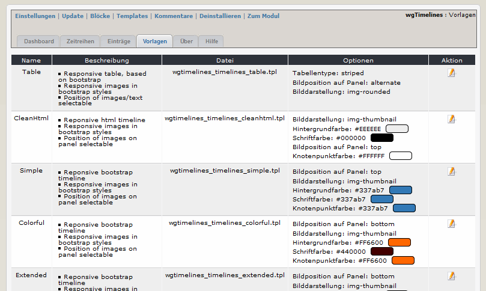

# 2.3 Vorlagen

Sie können die Vorlagen entsprechend Ihren Wünschen anpassen und bei Ihren Zeitreihen verwenden.

#### 2.3.1 Liste der Vorlagen
Auf den Registerblatt 'Vorlagen' sehen Sie eine Auflistung aller bereits festgelegten Vorlagen.

#### 2.3.2 Vorlagen bearbeiten

Abhängig von der Vorlage können unterschiedliche Optionen, wie z.B. Bildstyle, Farbe, usw. geändert werden.
