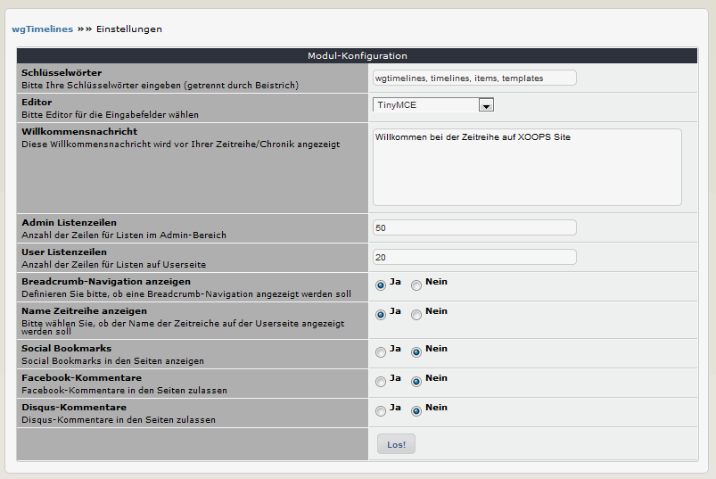

# 3. Einstellungen

In den Moduleinstellungen können Sie verschiedene Optionen festlegen: 

## 3.1 Optionen im Detail
#### Schlüsselwörter
Bitte hier die gewünschten Schlüsselwörter eingeben (getrennt durch einen Beistrich), welche dann in den Metatags verwendet werden.

#### Editor
Bitte wählen Sie den Editor für die Eingabefelder im Adminbereich.

#### Willkommensnachricht
Diese Willkommensnachricht wird vor Ihrer Zeitreihe/Chronik angezeigt

#### Admin Listenzeilen
Definieren Sie die Anzahl der Einträge in Listen im Adminbereich.

#### User Listenzeilen
Definieren Sie die Anzahl der Einträge in Listen im Userbereich.

#### Breadcrumbs-Navigation anzeigen
Definieren Sie bitte, ob eine Breadcrumb-Navigation angezeigt werden soll.

#### Name Zeitreihe anzeigen
Bitte wählen Sie, ob der Name der Zeitreiche auf der Userseite angezeigt werden soll

#### Maximale Größe
Definieren Sie bitte die maximale Größe für einen Dateiupload. Sie müssen den Wert für Bytes angegeben (10485760 = 1 MB).

#### Mime-Types
Definieren Sie bitte die zulässigen Dateitypen für einen Dateiupload.

#### Social Bookmarks
Social Bookmarks in den Seiten anzeigen

#### Facebook-Kommentare
Facebook-Kommentare in den Seiten zulassen

##### Disqus-Kommentare
Disqus-Kommentare in den Seiten zulassen
