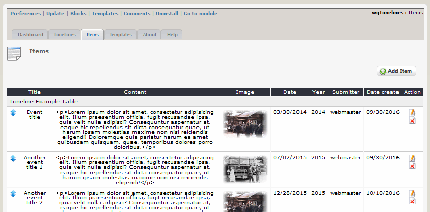

# 2.2 Items

You can define various members, which you can later combine with one or more teams.

#### 2.2.1 List items
On the dashboard tab 'Items' you see a list of the existing items.

You can change the sort order by drag&drop. Whether you use sort by date or weight you have to decide in the settings for the timelines (see also [Timelines](2admin_timelines.md)

#### 2.2.2 Add/edit items

#### Timeline
Please select the timeline, which should be related the item to

#### Title
Please enter a title for the item (optional)

#### Content
Please enter a content for the item

#### Image
You can add one image to your item (optional)

#### Date
Please enter the date for the item (optional)

#### Year
Please enter the year for the item (optional)
