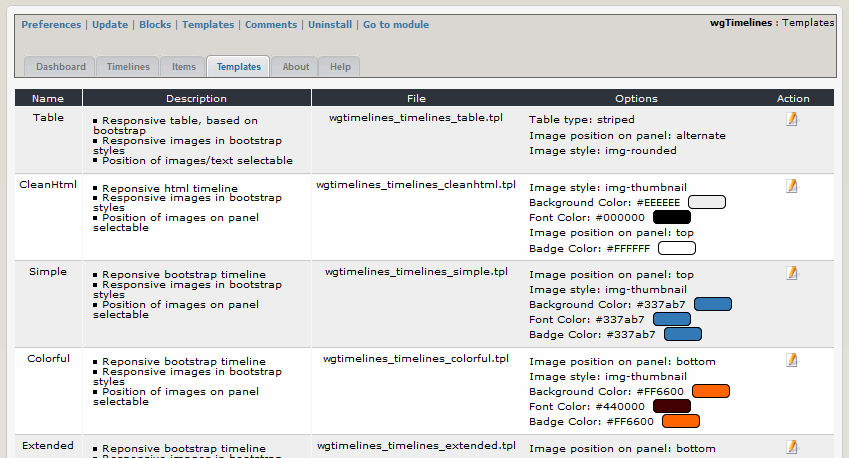

# 2.3 Templates

You can adopt the existing templates corresponding your wished and use them then for one or more timelines.

#### 2.3.1 List templates
On the dashboard tab 'Templates' you see a list of the existing templates with the settings.

#### 2.3.2 Edit templates

Depending on the template you can set various options like image style, color and so one.
