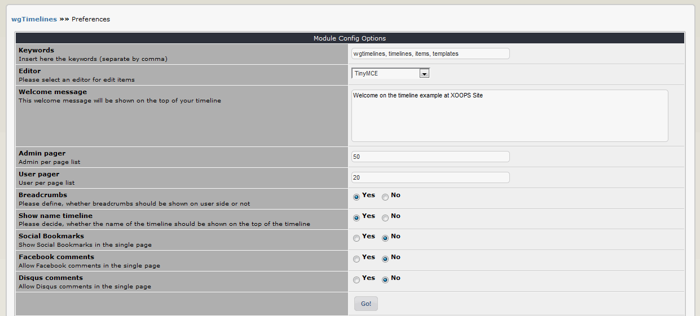

# 3. Preferences

In the module preferences you can set various options for this module: 

## 3.1 Options in detail
#### Keywords
You can add keywords, which are added to the meta tags. Seperate the keywords by comma.

#### Editor
You can decide, which editor should be used for editing on admin sides.

#### Welcome message
This welcome message will be shown on the top of your timeline

#### Admin pager
You can define the number of items for lists in admin area.

#### User pager
You can define the number of items for lists in user area.

#### Show breadcrumbs-navigation
Please decide, whether a breadcrumbs-navigation should be shown on user sides.

#### Show name timeline
Please decide, whether the name of the timeline should be shown on the top of the timeline

#### Max size
Please define the maximum file size foruploads file. You have to enter the value for bytes (10485760 = 1 MB).

#### Mime-Types
Define which mime-types are allowed for file upload.

#### Social Bookmarks
Show Social Bookmarks in the single page

#### Facebook comments
Allow Facebook comments in the single page

#### Disqus comments
Allow Disqus comments in the single page
